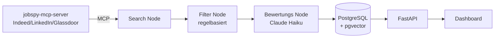

# Job Search Agent

KI-Agent, der Jobportale durchsucht, Ergebnisse filtert und nach Passung
zum eigenen Profil bewertet — von der Suche bis zum durchsuchbaren
Dashboard.

## Warum dieses Projekt

Klassische Jobsuche bedeutet: dieselben Suchbegriffe auf mehreren Portalen
wiederholen, Dutzende Stellenanzeigen lesen, bei denen "5+ Jahre Erfahrung"
schon im zweiten Satz disqualifiziert. Dieser Agent automatisiert Suche,
Vorfilterung und Bewertung — und lernt dabei, welche Stellen tatsächlich
zum eigenen Profil passen.

## Architektur

LangGraph-Pipeline: Search → Filter → Bewertung → Storage. Details und
Architektur-Entscheidungen in [CLAUDE.md](./CLAUDE.md).

## Tech-Stack

Python 3.11 · LangGraph · Anthropic Claude (Haiku) · FastAPI · PostgreSQL
+ pgvector · Docker · Langfuse · GCP Cloud Run

## Status

🚧 In aktiver Entwicklung. Fortschritt und Roadmap:
[GitHub Issues](https://github.com/pandashhh/job-search-agent/issues)
(21 Issues über 6 Meilensteine)

## Verwandte Projekte

- [research-agent](https://github.com/pandashhh/research-agent) —
  Multi-Agent-System mit LangGraph
- [anthropic-docs-rag](https://github.com/pandashhh/anthropic-docs-rag) —
  RAG-System mit Docker-Optimierung
- [rag-mcp-server](https://github.com/pandashhh/rag-mcp-server) —
  MCP-Server-Implementierung

## Setup

_Folgt, sobald der erste lauffähige Stand steht (siehe Issue #2)._